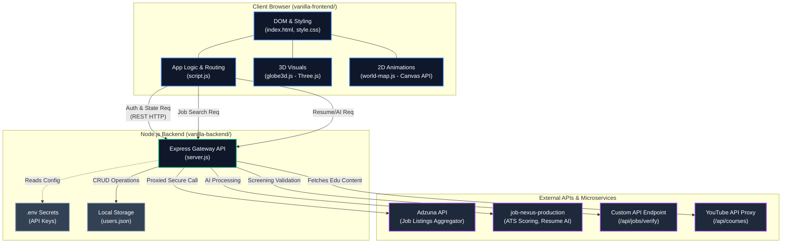
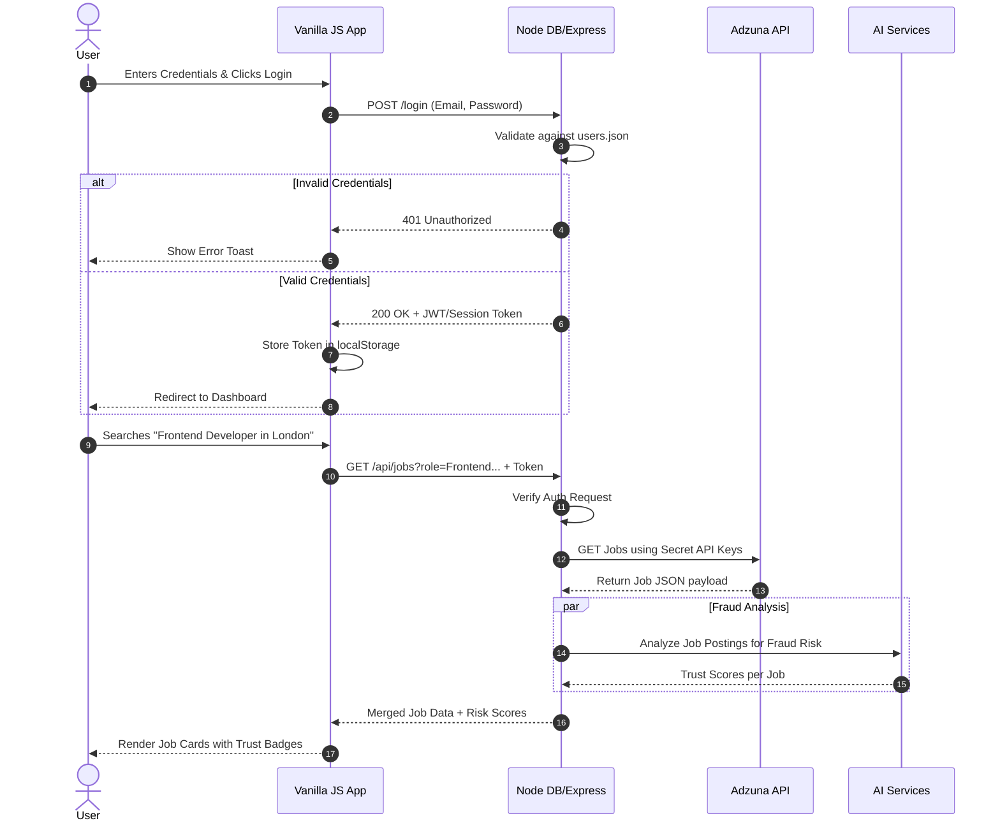

# CareerSprout Detailed Architecture Diagram

This document contains the detailed architecture and data flow diagrams for the CareerSprout application based on the current Vanilla JS and Node.js setup.

## 1. Comprehensive System Architecture

This diagram illustrates the full full-stack architecture, including the structural files of the frontend, the backend proxy, and the external services.

## 2. Authentication & Data Flow Lifecycle

This diagram shows the sequence of events during a core user journey (e.g., Logging in and Searching for a job). It demonstrates how the frontend communicates with the backend, which in turn orchestrates calls to external systems.

